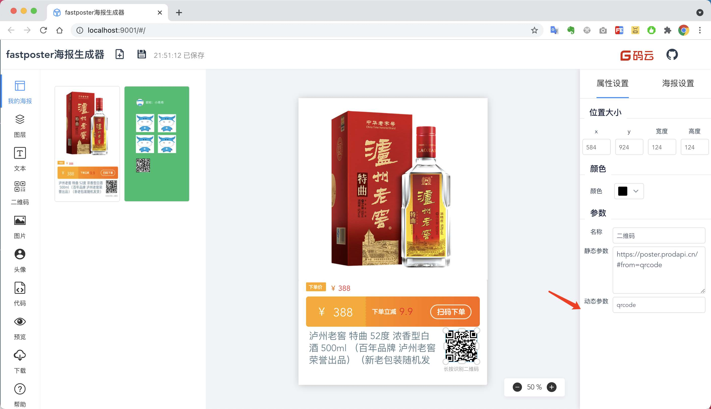
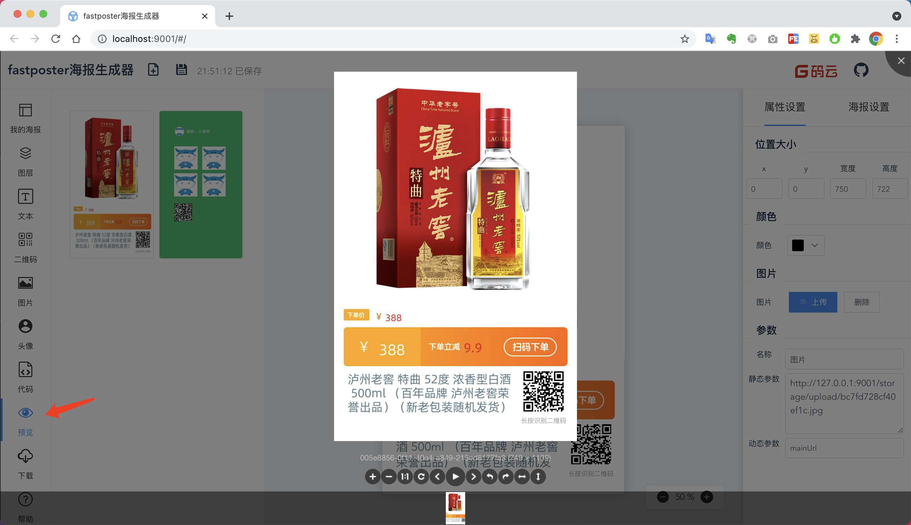
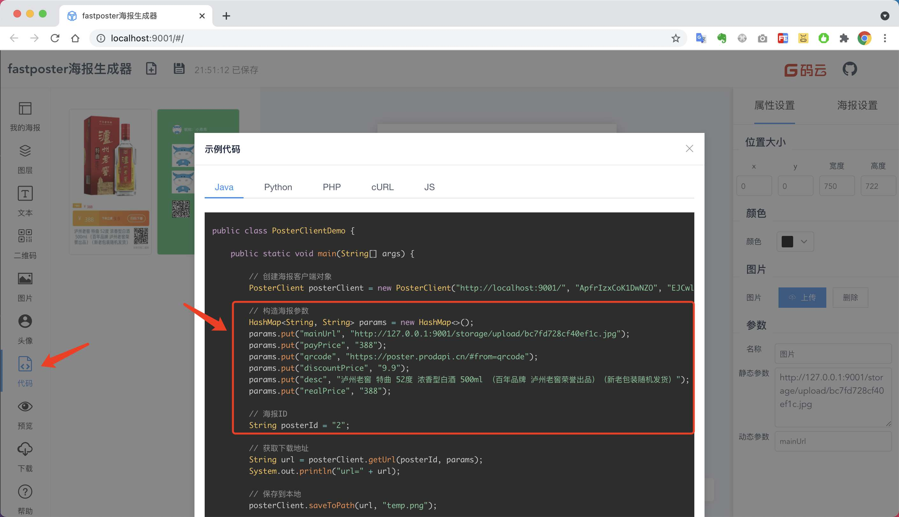

# 快速开始

## 启动服务

推荐使用`docker`启动

```bash
docker run --name fast-poster -p 9001:9001 tangweixin/fast-poster
```

## 编辑海报

打开海报编辑器 [http://localhost:9001/](http://localhost:9001/)

* 上传背景图
* 添加所需组件
* 设置动态参数




## 预览海报

点击左侧`预览`按钮，查看海报实际生成效果

!> 由于使用海报使用`Pillow`生成，效果与设计器有些许偏差，请以`预览`的实际效果为准



## 生成代码

点击左侧`代码`按钮，可以生成多种语言的调用代码，并可直接使用。



## 代码讲解

- 一、通过传递`动态参数`，获取海报的`下载地址`
- 二、访问海报的`下载链接`，即可返回图片流

```java
public static void main(String[] args) {

    // 创建海报客户端对象
    PosterClient posterClient = new PosterClient("http://localhost:9001/", "ApfrIzxCoK1DwNZO", "EJCwlrnv6QZ0PCdvrWGi");

    // 构造海报参数
    HashMap<String, String> params = new HashMap<>();
    params.put("mainUrl", "http://127.0.0.1:9001/storage/upload/bc7fd728cf40ef1c.jpg");
    params.put("payPrice", "388");
    params.put("qrcode", "https://poster.prodapi.cn/#from=qrcode");
    params.put("discountPrice", "9.9");
    params.put("desc", "泸州老窖 特曲 52度 浓香型白酒 500ml （百年品牌 泸州老窖荣誉出品）（新老包装随机发货）");
    params.put("realPrice", "388");

    // 海报ID
    String posterId = "2";

    // 获取下载地址
    String url = posterClient.getUrl(posterId, params);
    System.out.println("url=" + url);

    // 保存到本地
    posterClient.saveToPath(url, "temp.png");

}
```

## 下载海报

点击`下载`按钮，可以直接下载海报