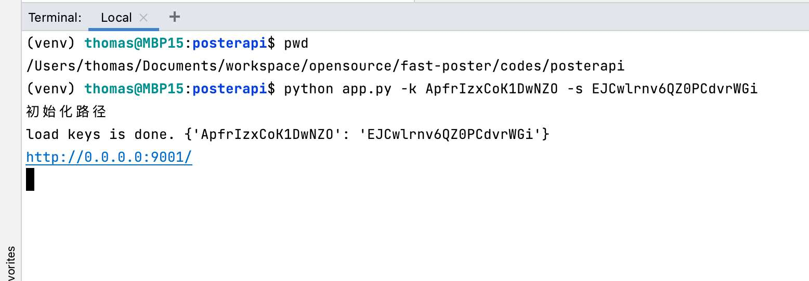

# 源码运行

如果需要从源码运行，请使用如下命令

## 安装依赖

```bash
pip install -i https://pypi.tuna.tsinghua.edu.cn/simple -r requirements.txt
```

## 启动应用

!> 需要先进入代码目录，再执行`python`命令。

```bash
python app.py -k ApfrIzxCoK1DwNZO -s EJCwlrnv6QZ0PCdvrWGi
```

>启动效果



